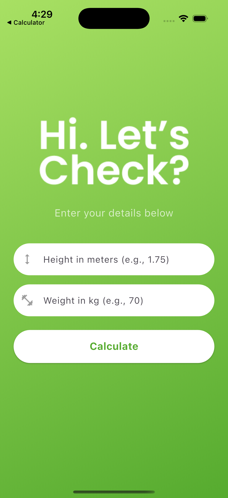
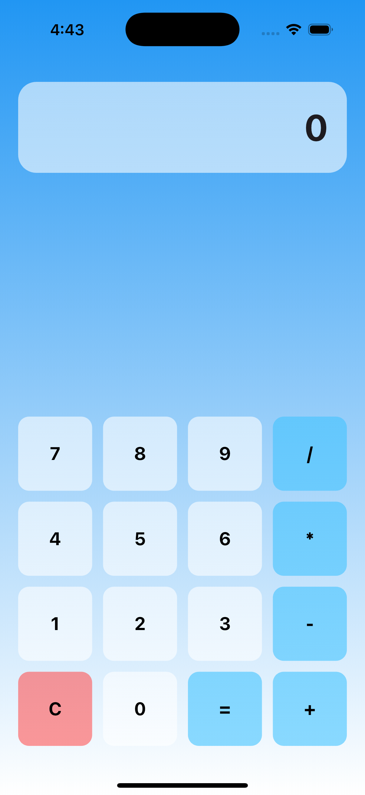

# 🚀 Faisal's Flutter Playground

<p align="center">
  
  
</p>

<p align="center">
  <i>A curated collection of beautiful and functional applications I've built while mastering Flutter.</i>
</p>

---

## ✨ Featured Projects

This repository showcases my journey and skills in mobile app development using Flutter. Each project is a standalone app with a unique UI and functionality.

| BMI Calculator 💚                                                                                                         | Calculator 💙                                                                                                                |
| ------------------------------------------------------------------------------------------------------------------------- | ---------------------------------------------------------------------------------------------------------------------------- |
|                                                         |                                                  |
| **A sleek, modern Body Mass Index calculator.**                                                                           | **A clean, functional calculator for everyday use.**                                                                         |
| A minimalist design that focuses on a great user experience. Enter your height and weight to get your BMI instantly.      | Features a beautiful gradient background and neumorphic-style buttons that provide a satisfying tactile feel.                |
| **Features:**<br><ul><li>Clean & intuitive UI</li><li>Real-time calculations</li><li>Helpful input placeholders</li></ul> | **Features:**<br><ul><li>All basic arithmetic operations</li><li>Responsive design</li><li>Clear button for resets</li></ul> |
| `➡️ /flutter/bmicalculator` _(example path)_                                                                              | `➡️ /flutter/calculator` _(example path)_                                                                                    |

---

## 🛠️ Tech Stack

These projects are built using the latest in Flutter and Dart, focusing on clean code, performance, and a great user experience.

- **[Flutter](https://flutter.dev/):** The core framework for building beautiful, natively compiled, multi-platform applications from a single codebase.
- **[Dart](https://dart.dev/):** The powerful, object-oriented programming language that powers Flutter.
- **State Management:** (e.g., `setState`) for managing the app's state in a simple and efficient way.
- **Custom UI Widgets:** Building unique and custom user interfaces from scratch to match design requirements.

---

## ⚙️ Getting Started

Want to run these projects on your local machine? Follow these simple steps.

### Prerequisites

- You have the [Flutter SDK](https://flutter.dev/docs/get-started/install) installed.
- An editor like VS Code or Android Studio.

### Installation

1.  **Clone the repository:**
    ```sh
    git clone [https://github.com/your-username/your-repo-name.git](https://github.com/your-username/your-repo-name.git)
    ```
2.  **Navigate to a project directory:**
    ```sh
    cd your-repo-name/bmi_calculator  # Or /simple_calculator
    ```
3.  **Install dependencies:**
    ```sh
    flutter pub get
    ```
4.  **Run the app:**
    ```sh
    flutter run
    ```
    The app should now be running on your connected device or emulator!

---

## 💡 Future Goals

I'm always looking to improve and add more to this collection. Here's what's next:

- [ ] **BMI Calculator:** Add a history feature and a results page with more detailed information.
- [ ] **Calculator:** Implement scientific functions and themes (dark/light mode).

---

## 📬 Connect With Me

Feel free to reach out, connect, or check out my other work!

<p align="left">
  <a href="https://github.com/heyahammad" target="_blank"></a>
  <a href="https://linkedin.com/in/heyahammad" target="_blank"></a>
  <a href="https://twitter.com/heyahammad" target="_blank"></a>
</p>
